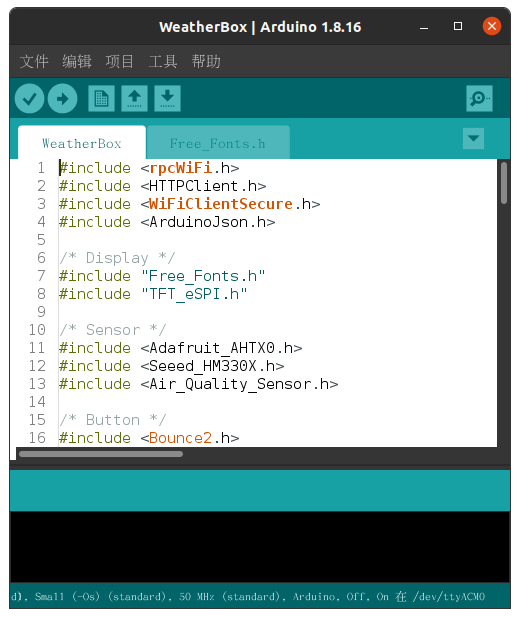

# Wio Terminal 天气小助手

作者邮箱：luhuadong@163.com，更新日期：2022-05-30


## 项目概述

这个 Demo 展示了如何使用 Wio Terminal 实现一个天气小助手，Wio Terminal 通过 I2C 接口连接传感器实时监测室内环境温湿度和空气质量，同时通过 WiFi 网络获取当地天气信息以及未来三天的天气预报，使用按键即可切换显示界面。

### 实现功能

- 开机自动联网获取实况天气和预报天气（未来三天）
- 在主界面同时显示室外和室内的温湿度
- 按上方左键可手动更新天气信息
- 可通过五向开关的 Left 和 Right 键翻页查看未来几天的天气预测

### 重点难点

- 实现传感器数据的实时读取和显示
- 从 Web API 获取天气信息并解析 JSON 数据

### 硬件材料

- 1 x Wio Terminal
- 1 x AHT10 温湿度传感器
- 1 x PM2.5 传感器
- 1 x 空气质量传感器

### 依赖库

- rpcWiFi.h
- HTTPClient.h
- WiFiClientSecure.h
- ArduinoJson.h
- Free_Fonts.h
- TFT_eSPI.h
- Adafruit_AHTX0.h
- Seeed_HM330X.h
- Air_Quality_Sensor.h
- Bounce2.h


## 整体框架


## 开发步骤

### 安装依赖库

本示例 Demo 依赖 **LCD** 库、**ArduinoJson** 库、**AHTX0** 库、**Seeed_HM330X** 库、**Air_Quality_Sensor** 库和 **Bounce2** 库：

- `LCD` 库在安装 *Seeed SAMD Boards* 库时已经包含了，大家可以参考 [Wio Terminal 开发环境](https://getiot.tech/wiot/wio-terminal-development-environment.html)。
- `ArduinoJson` 库可以在 [GitHub 仓库](https://github.com/bblanchon/ArduinoJson)下载，在 Arduino IDE 点击 *项目 > 加载库 > 添加 .ZIP 库…* 即可添加库。
- `AHTX0` 库可以在 [GitHub 仓库](https://github.com/adafruit/Adafruit_AHTX0)下载，在 Arduino IDE 点击 *项目 > 加载库 > 添加 .ZIP 库…* 即可添加库。
- `Seeed_HM330X` 库可以在 [GitHub 仓库](https://github.com/Seeed-Studio/Seeed_PM2_5_sensor_HM3301)下载，在 Arduino IDE 点击 *项目 > 加载库 > 添加 .ZIP 库…* 即可添加库。
- `Air_Quality_Sensor` 库可以在 [GitHub 仓库](https://github.com/Seeed-Studio/Grove_Air_quality_Sensor)下载，在 Arduino IDE 点击 *项目 > 加载库 > 添加 .ZIP 库…* 即可添加库。
- `Bounce2` 库可以在 [GitHub 仓库](https://github.com/thomasfredericks/Bounce2)下载，在 Arduino IDE 点击 *项目 > 加载库 > 添加 .ZIP 库…* 即可添加库。

提示：这些库也可以在 Arduino IDE 库管理器中搜索并安装。

另外，我们还使用了 `Free_Fonts.h` 库提供的一些免费字体，可以点击[这里](https://files.seeedstudio.com/wiki/Wio-Terminal/res/Free_Fonts.h)下载，并将它放在 Arduino 工程中。


### 创建工程

打开 Arduino IDE，点击“文件 -> 新建”，按 Ctrl + S 将文件保存为 WeatherBox 项目。




### 读取传感器

读取 AHT10 传感器温湿度数据的示例代码如下：

```cpp
#include <Adafruit_AHTX0.h>

Adafruit_AHTX0 aht;

void setup() {
    Serial.begin(115200);

    if (! aht.begin()) {
        while (1) delay(10);
    }
}

void loop() {
    sensors_event_t humidity, temp;
    
    // populate temp and humidity objects with fresh data
    aht.getEvent(&humidity, &temp);
    
    Serial.print("Temperature: "); Serial.print(temp.temperature); 
    Serial.print("Humidity: "); Serial.print(humidity.relative_humidity);

    delay(500);
}
```


### 天气 API

有很多提供天气信息的 Web API，可以参考《[一些好用的天气 API](https://getiot.tech/article/the-best-weather-api.html)》，本文使用高德地图 API 获取实时天气及天气预测。GET 请求的 URL 如下：

**实时天气**（当天）

```bash
https://restapi.amap.com/v3/weather/weatherInfo?city=441802&key=yourkey
```

**天气预测**（未来三天）

```bash
https://restapi.amap.com/v3/weather/weatherInfo?city=441802&key=yourkey&extensions=all
```

参数说明：

- `city` 是城市编码，比如 441802 代表广州；
- `key` 是应用对应的代码，需要在平台申请（提示：将 `yourkey` 替换为你申请的 Key 代码）；
- `extensions` 表示获取类型，缺省值是 `base`，表示获取实况天气，`all` 表示获取预报天气；
- `output` 表示返回格式，可选 JSON 或 XML，默认返回 JSON 格式数据。

以实时天气 API 为例，返回的 JSON 数据如下：

```json
{
    "status":"1",
    "count":"1",
    "info":"OK",
    "infocode":"10000",
    "lives":[
        {"province":"广东",
         "city":"广州市",
         "adcode":"440100",
         "weather":"晴",
         "temperature":"17",
         "winddirection":"北",
         "windpower":"≤3",
         "humidity":"64",
         "reporttime":"2021-12-12 19:00:44"
        }
    ]
}
```


### 完整代码

提示：将下面代码中的 `ssid` 和 `password` 替换成你的 WiFi 网络；将 `URL_BASE` 和 `URL_ALL` 中的 `cityCode` 替换成需要查询的城市，将 `yourKey` 替换成你的 Key。

另外，本 Demo 并未实现中文显示，如需显示中文字体，可参考 [Wio Terminal LCD 中文显示](https://getiot.tech/wiot/wio-terminal-lcd-fonts-cn.html)。

```cpp
#include <rpcWiFi.h>
#include <HTTPClient.h>
#include <WiFiClientSecure.h>
#include <ArduinoJson.h>

/* Display */
#include "Free_Fonts.h"
#include "TFT_eSPI.h"

/* Sensor */
#include <Adafruit_AHTX0.h>

/* Button */
#include <Bounce2.h>

// INSTANTIATE 3 Button OBJECT
Bounce2::Button btnA = Bounce2::Button();
Bounce2::Button btnL = Bounce2::Button();
Bounce2::Button btnR = Bounce2::Button();

Adafruit_AHTX0 aht;
TFT_eSPI       tft;

const char* ssid = "yourNetworkName";
const char* password = "yourNetworkPassword";

const char* URL_BASE = "https://restapi.amap.com/v3/weather/weatherInfo?city=cityCode&key=yourKey";
const char* URL_ALL  = "https://restapi.amap.com/v3/weather/weatherInfo?city=cityCode&key=yourKey&extensions=all";

WiFiClientSecure client;

#define STR_SIZE_MAX   16

typedef struct lives {
    char province[16];
    char city[16];
    char adcode[16];
    char weather[16];
    char temperature[16];
    char humidity[16];
    char winddirection[16];
    char windpower[16];
    char reporttime[16];
} lives_t;

lives_t lives_data;

typedef struct forecasts {
    char date[16];
    char week[16];
    char dayweather[16];
    char nightweather[16];
    char daytemp[16];
    char nighttemp[16];
    char daywind[16];
    char nightwind[16];
    char daypower[16];
    char nightpower[16];
} forecasts_t;

#define FORECASTS_SIZE  4
forecasts_t forecasts_data[FORECASTS_SIZE];

enum {
    PAGE_1 = 1,
    PAGE_2 = 2,
    PAGE_3 = 3,
    PAGE_4 = 4,
    PAGE_5 = 5,
    PAGE_MAX = PAGE_5
};

int currentPage = PAGE_1;
boolean pageChanged = false;
boolean update_flag = true;

void setup()
{
    btnA.attach( WIO_KEY_C ,  INPUT_PULLUP );
    btnL.attach( WIO_5S_LEFT ,  INPUT_PULLUP );
    btnR.attach( WIO_5S_RIGHT ,  INPUT_PULLUP );

    btnA.interval(5);
    btnL.interval(5);
    btnR.interval(5);

    btnA.setPressedState(LOW); 
    btnL.setPressedState(LOW); 
    btnR.setPressedState(LOW); 

    Serial.begin(115200);

    if (! aht.begin()) {
        Serial.println("Could not find AHT? Check wiring");
        while (1) delay(10);
    }
    Serial.println("AHT10 or AHT20 found");

    tft.init();
    tft.setRotation(3);
    tft.fillScreen(tft.color565(24,15,60));
    tft.fillScreen(TFT_NAVY);
    tft.setFreeFont(FMB12);
    tft.setCursor((320 - tft.textWidth("Funpack Weather Box"))/2, 100);
    tft.print("Funpack Weather Box");

    tft.setFreeFont(FM9);
    tft.setTextColor(TFT_LIGHTGREY);
    tft.setCursor((320 - tft.textWidth("Connecting WiFi..."))/2, 180);
    tft.print("Connecting WiFi...");
    
    WiFi.begin(ssid, password);

    while (WiFi.status() != WL_CONNECTED) { //Check for the connection
        delay(500);
        Serial.println("Connecting WiFi...");
    }
    Serial.print("Connected to the WiFi network with IP: ");
    Serial.println(WiFi.localIP());
    //client.setCACert(test_root_ca);

    if(&client) {   
        getWeatherLives();
        getWeatherForecasts();
    }
    drawWeatherLivePage(lives_data);
}

void loop()
{
    btnA.update();
    btnL.update();
    btnR.update();

    if ( btnA.pressed() ) {
        pageChanged = true;
        getWeatherLives();
        getWeatherForecasts();
        currentPage = PAGE_1;
        Serial.print("updated!");
    }

    if ( btnL.pressed() ) {
        pageChanged = true;
        currentPage--;
        if (currentPage < PAGE_1) {
            currentPage = PAGE_MAX;
        }
        Serial.print("prev page: ");Serial.println(currentPage);
    }

    if ( btnR.pressed() ) {
        pageChanged = true;
        currentPage++;
        if (currentPage > PAGE_MAX) {
            currentPage = PAGE_1;
        }
        Serial.print("next page: ");Serial.println(currentPage);
    }
    
    switch (currentPage) {
      case PAGE_1:
      {
        static int cnt = 0;
        if (pageChanged) {
          drawWeatherLivePage(lives_data);
          updateSensorData();
        }
        if (cnt++ % 100000 == 0) {
          updateSensorData();
        }
        
        pageChanged = false;
      } break;
      case PAGE_2:
      {
        if (pageChanged) {
          drawWeatherForecastPage(&forecasts_data[0]);
        }
        pageChanged = false;
      } break;
      case PAGE_3:
      {
        if (pageChanged) {
          drawWeatherForecastPage(&forecasts_data[1]);
        }
        pageChanged = false;
      } break;
      case PAGE_4:
      {
        if (pageChanged) {
          drawWeatherForecastPage(&forecasts_data[2]);
        }
        pageChanged = false;
      } break;
      case PAGE_5:
      {
        if (pageChanged) {
          drawWeatherForecastPage(&forecasts_data[3]);
        }
        pageChanged = false;
      } break;
      default: break;
    }
}

void updateSensorData()
{
    sensors_event_t humi, temp;
    aht.getEvent(&humi, &temp);// populate temp and humidity objects with fresh data

    drawTempValue(temp.temperature);
    drawHumiValue(humi.relative_humidity);
}

void drawTempValue(const float temp) {
   tft.setFreeFont(FMB24);
   tft.setTextColor(TFT_RED, tft.color565(40,40,86));
   tft.drawString(String(temp, 1), 30, 140);
}

void drawHumiValue(const float humi) {
   tft.setFreeFont(FMB24);
   tft.setTextColor(TFT_GREEN, tft.color565(40,40,86));
   tft.drawString(String(humi, 1), 180, 140);
}

void drawWeatherLivePage(lives_t &lives_data)
{
    // -----------------LCD---------------------

    tft.fillScreen(tft.color565(24,15,60));
    tft.setFreeFont(FF17);
    tft.setTextColor(tft.color565(224,225,232));
    tft.drawString("Funpack Weather Box", 10, 10);

    tft.setFreeFont(FMB9);
    if (0 == strcmp(lives_data.weather, "晴")) {
      tft.setTextColor(TFT_ORANGE);
      tft.drawString("sunny", 240, 10);
    } else if (0 == strcmp(lives_data.weather, "多云")) {
      tft.setTextColor(TFT_WHITE);
      tft.drawString("cloudy", 240, 10);
    } else if (0 == strcmp(lives_data.weather, "阴")) {
      tft.setTextColor(TFT_LIGHTGREY);
      tft.drawString("cloudy", 240, 10);
    } else if (0 == strcmp(lives_data.weather, "雨")) {
      tft.setTextColor(TFT_DARKCYAN);
      tft.drawString("rainy", 240, 10);
    }
 
    tft.fillRoundRect(10,  45, 145, 180, 5, tft.color565(40,40,86));
    tft.fillRoundRect(165, 45, 145, 180, 5, tft.color565(40,40,86));

    tft.setFreeFont(FM9);
    tft.setTextColor(TFT_WHITE);
    tft.drawString("Temperature", 25, 60);
    tft.drawString("Humidity",   195, 60);
    
    tft.setTextColor(TFT_DARKGREY);
    tft.drawString("degrees C",   35, 200);
    tft.drawString("% rH",       220, 200);

    tft.setFreeFont(FMB24);
    tft.setTextColor(TFT_RED, tft.color565(40,40,86));
    tft.drawString(lives_data.temperature, 30, 100);
    Serial.println(lives_data.temperature);

    tft.setFreeFont(FMB24);
    tft.setTextColor(TFT_GREEN, tft.color565(40,40,86));
    tft.drawString(lives_data.humidity, 180, 100);
    Serial.println(lives_data.humidity);
}

void drawWeatherForecastPage(forecasts_t *forecasts_data)
{
    // -----------------LCD---------------------

    tft.fillScreen(tft.color565(24,15,60));
    tft.setFreeFont(FF17);
    tft.setTextColor(tft.color565(224,225,232));
    tft.drawString(forecasts_data->date, 120, 10);

    tft.fillRoundRect(10,  45, 300, 180, 5, tft.color565(40,40,86));

    tft.setFreeFont(FM9);
    tft.drawString("    Weather", 25, 60);
    tft.drawString("  Day  temp", 25, 90);
    tft.drawString("Night  temp", 25, 120);
    tft.drawString("  Day power", 25, 150);
    tft.drawString("Night power", 25, 180);

    tft.setFreeFont(FS9);
    tft.setTextColor(TFT_DARKGREY);
    tft.drawString("'C", 250, 90);
    tft.drawString("'C", 250, 120);
    tft.drawString("level", 250, 150);
    tft.drawString("level", 250, 180);

    tft.drawFastVLine(160, 60, 140, TFT_DARKGREY);

    tft.setFreeFont(FMB9);
    tft.setTextColor(TFT_RED, tft.color565(40,40,86));
    tft.drawString(forecasts_data->daytemp, 190, 90);
    
    tft.setTextColor(TFT_GREEN, tft.color565(40,40,86));
    tft.drawString(forecasts_data->nighttemp, 190, 120);
    
    tft.setTextColor(TFT_MAGENTA, tft.color565(40,40,86));
    tft.drawString(forecasts_data->daypower, 190, 150);
    
    tft.setTextColor(TFT_PURPLE, tft.color565(40,40,86));
    tft.drawString(forecasts_data->nightpower, 190, 180);

    tft.setFreeFont(FMB9);
    if (0 == strcmp(forecasts_data->dayweather, "晴")) {
      tft.setTextColor(TFT_ORANGE);
      tft.drawString("sunny", 190, 60);
    } else if (0 == strcmp(forecasts_data->dayweather, "多云")) {
      tft.setTextColor(TFT_WHITE);
      tft.drawString("cloudy", 190, 60);
    } else if (0 == strcmp(forecasts_data->dayweather, "阴")) {
      tft.setTextColor(TFT_LIGHTGREY);
      tft.drawString("cloudy", 190, 60);
    } else if (0 == strcmp(forecasts_data->dayweather, "雨")) {
      tft.setTextColor(TFT_DARKCYAN);
      tft.drawString("rainy", 190, 60);
    }
}

void getWeatherLives()
{
    HTTPClient https;
    
    if (https.begin(client, URL_BASE))
    {
        int httpCode = https.GET();
        
        if (httpCode > 0)
        {
            if (httpCode == HTTP_CODE_OK || httpCode == HTTP_CODE_MOVED_PERMANENTLY) 
            {
                String payload = https.getString();
                Serial.println(payload);
                
                const size_t capacity = JSON_OBJECT_SIZE(5) + JSON_OBJECT_SIZE(9) + 250;
                DynamicJsonDocument doc(capacity);
                deserializeJson(doc, payload);

                strncpy(lives_data.province, doc["lives"][0]["province"], STR_SIZE_MAX);
                strncpy(lives_data.city, doc["lives"][0]["city"], STR_SIZE_MAX);
                strncpy(lives_data.weather, doc["lives"][0]["weather"], STR_SIZE_MAX);
                strncpy(lives_data.temperature, doc["lives"][0]["temperature"], STR_SIZE_MAX);
                strncpy(lives_data.humidity, doc["lives"][0]["humidity"], STR_SIZE_MAX);
                strncpy(lives_data.winddirection, doc["lives"][0]["winddirection"], STR_SIZE_MAX);
                strncpy(lives_data.windpower, doc["lives"][0]["windpower"], STR_SIZE_MAX);
                strncpy(lives_data.reporttime, doc["lives"][0]["reporttime"], STR_SIZE_MAX);
            }
        } else {
          Serial.printf("[HTTPS] GET... failed, error: %s\n", https.errorToString(httpCode).c_str());
        }
        https.end();
    } else {
        Serial.printf("[HTTPS] Unable to connect\n");
    }
}

void getWeatherForecasts()
{
    HTTPClient https;

    if (https.begin(client, URL_ALL))
    {
        int httpCode = https.GET();
        
        if (httpCode > 0) 
        {            
            if (httpCode == HTTP_CODE_OK || httpCode == HTTP_CODE_MOVED_PERMANENTLY) 
            {
                String payload = https.getString();
                Serial.println(payload);
                
                const size_t capacity = JSON_OBJECT_SIZE(5) + JSON_OBJECT_SIZE(5) + 3 * JSON_OBJECT_SIZE(10) + 1250;
                DynamicJsonDocument doc(capacity);
                deserializeJson(doc, payload);

                for (int i=0; i<FORECASTS_SIZE; i++)
                {
                    strncpy(forecasts_data[i].date, doc["forecasts"][0]["casts"][i]["date"], STR_SIZE_MAX);
                    strncpy(forecasts_data[i].week, doc["forecasts"][0]["casts"][i]["week"], STR_SIZE_MAX);
                    strncpy(forecasts_data[i].dayweather, doc["forecasts"][0]["casts"][i]["dayweather"], STR_SIZE_MAX);
                    strncpy(forecasts_data[i].nightweather, doc["forecasts"][0]["casts"][i]["nightweather"], STR_SIZE_MAX);
                    strncpy(forecasts_data[i].daytemp, doc["forecasts"][0]["casts"][i]["daytemp"], STR_SIZE_MAX);
                    strncpy(forecasts_data[i].nighttemp, doc["forecasts"][0]["casts"][i]["nighttemp"], STR_SIZE_MAX);
                    strncpy(forecasts_data[i].daywind, doc["forecasts"][0]["casts"][i]["daywind"], STR_SIZE_MAX);
                    strncpy(forecasts_data[i].nightwind, doc["forecasts"][0]["casts"][i]["nightwind"], STR_SIZE_MAX);
                    strncpy(forecasts_data[i].daypower, doc["forecasts"][0]["casts"][i]["daypower"], STR_SIZE_MAX);
                    strncpy(forecasts_data[i].nightpower, doc["forecasts"][0]["casts"][i]["nightpower"], STR_SIZE_MAX);
                }
            }
        } else {
          Serial.printf("[HTTPS] GET... failed, error: %s\n", https.errorToString(httpCode).c_str());
        }
        https.end();    
    } else {
        Serial.printf("[HTTPS] Unable to connect\n");
    }
}
```

最新代码请从 GitHub 仓库获取：[https://github.com/luhuadong/funpack-wio-terminal](https://github.com/luhuadong/funpack-wio-terminal/tree/main/firmware/WeatherBox)


### 运行效果

点击 Arduino IDE 工具栏中的“上传”按钮，编译并上传程序到 Wio Terminal，运行效果如下图所示。


演示视频：[https://www.bilibili.com/video/BV1Cq4y127wy/](https://www.bilibili.com/video/BV1Cq4y127wy/)

